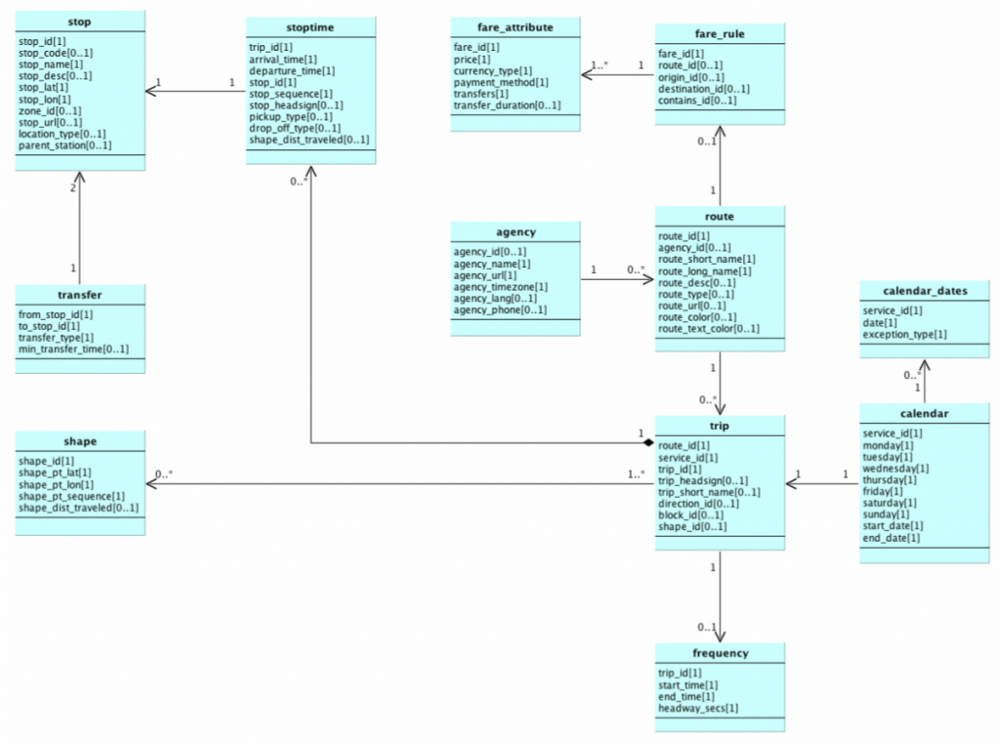

# Data description and access  

This chapter describes how to access all the data needed to (re)create the aforementioned statistics.


```{r, echo=FALSE, eval=TRUE, warning=FALSE, message=FALSE}
library(webshot)

library(sf)
library(dplyr)
library(glue)
library(gtfstools)
library(tidyverse)
library(lubridate)
library(colorspace)
library(terra)
library(opentripplanner) 
library(gtfs2gps)
library(elevatr)
library(terra)
library(stringi)
library(openrouteservice)
library(sf)
```


## GTFS


The General Transit Feed Specification (GTFS) is a data specification that allows public transit agencies to publish their transit data in a format that can be consumed by a wide variety of software applications.^[https://gtfs.org/] Today, the GTFS data format is used by thousands of public transport providers. GTFS is a global specification used to publish public transport routes and timetables for journey planning purposes, originally created by Google.^[https://developers.google.com/transit/gtfs] Since many journey planning applications rely on GTFS data availability, several cities and major operators provide their route and timetable information in this format. 

Basically, GTFS is a way public transport providers structure their data on the location of public transport stops, routes, schedules, accessibility, modes, etc. This data can then be downloaded and used to create routing software.

  

The Netherlands GTFS used in this example data comes from http://gtfs.openov.nl/gtfs-rt/, but Transitfeeds.com ^[https://transitfeeds.com/l/60-europe] and mobilitydata^[https://database.mobilitydata.org/] have quite comprehensive lists of most GTFS data formats for Europe. In addition, the European Commission also maintains a list of National Access Points.^[https://transport.ec.europa.eu/system/files/2022-04/its-national-access-points_0.pdf]


Access to GTFS schedule data is quite straightforward. The data format is well explained on the GTFS website^[https://gtfs.org/schedule/reference/]: it is a relational database split over different .txt files. This data also contains (meta)data on the location of public transport stops and the routes that pass them. The schema of the GTFS data shown in Figure below comes from the SwissOpen-Data plattform Mobilität Schweiz Schweiz^[https://opentransportdata.swiss/de/cookbook/gtfs/]. 


```{r,echo=FALSE, fig.cap = 'GTFS data schematic',out.width="100%"}

```


To load this data, into for example R, you can use the `gtfstools` package. This and other packages to load the data, require the data to be in a .zip format. The GTFS data for the Netherlands is by default named`gtfs-openov-nl.zip`.  The GTFS data for the Netherlands only contains the following fields, but these are sufficient for now:


- agency.txt (contains information on transit agencies with services represented in this dataset)
- calendar_dates.txt (contains information on  all dates of service.)
- feed_info.txt (dataset metadata, including publisher, version, and expiration information.)
- stops.txt (stops where vehicles pick up or drop off riders. Also defines stations and station entrances.)
- routes.txt (transit routes. A route is a group of trips that are displayed to riders as a single service)
- trips.txt (trips for each route. A trip is a sequence of two or more stops that occur during a specific time period)
- stop_times.txt (times that a vehicle arrives at and departs from stops for each trip)
- shapes.txt (paths, in longitude and latitudes that vehicles take)


## OpenStreetMaps

OpenStreetMap^[https://www.openstreetmap.org/about] or OSM is an open-source world map which can be used to estimate travel time and distance over a road network. It also contains metadata on most streets, indicating that a street might be a one-way street, for example. I use OSM data as the base map for the routing algorithm.
There are different ways to incorporate OpenStreetMap data into R. The easiest way is probably to go to http://download.geofabrik.de/ and download the smallest possible map area that still contains the Urban Area you are interested in. You can also copy the download link of the map and download it directly into R using the`download.file()` function.

```{r, eval =FALSE}
link_to_country_osm_file <- "https://download.geofabrik.de/europe/netherlands/zuid-holland-latest.osm.pbf"
name_country_osm_file    <- "data/zuid-holland-latest.osm.pbf"

download.file(url      = link_to_country_osm_file,
              destfile = name_country_osm_file)
```


## Urban Area Shapefile


The European Commission^[https://ec.europa.eu/eurostat/web/cities/spatial-units] has quite clear and strict definitions of what constitutes a City, Functional Urban Area, and Greater City:

- A City is a local administrative unit (LAU) where the majority of the population lives in an urban centre of at least 50 000 inhabitants.
- The Functional Urban Area consists of a city and its commuting zone. (This was formerly known as the Larger Urban Zone (LUZ)).
- The Greater City is an approximation of the urban centre when this stretches far beyond the administrative city boundaries.


```{r, echo=FALSE,out.width="33%",fig.cap=" definition of a City, Greater City, and Functional Urban Area",fig.show='hold',fig.align='center'}
knitr::include_graphics(c("images/city.png", "images/Greater-City.png", "images/FUA.png"))
``` 


The shapefiles for these Functional Urban Areas can be downloaded from the Eurostat website^[https://ec.europa.eu/eurostat/web/gisco/geodata/reference-data/administrative-units-statistical-units/urban-audit]. In these shapefiles every Functional Urban Area has a unique ID, named `URAU_CODE`. The unique URAU_CODE for The Hague is for example NL001L3.


```{r, echo= FALSE, out.width="100%", out.height="500px", message=FALSE}
#install.packages("webshot")
#webshot::install_phantomjs()

path_to_shape_file       <- "data/URAU_RG_100K_2020_3857_FUA.shp/URAU_RG_100K_2020_3857_FUA.shp"
name_layer               <- "URAU_RG_100K_2020_3857_FUA"
urban_area_of_interest   <- "NL001L3"

library(webshot)
library(sf)
FUA_shape_file <- readr::read_rds("bigfiles/FUA_shape_file.rds")
mapview::mapview(FUA_shape_file, map.types = c("CartoDB.DarkMatter"), col.regions = "yellow")
```

To select the shapefile of just The Hague FUA, you can simply filter out the using URAU_CODE NL001L3 (set in `urban_area_of_interest`) 

```{r}
FUA_shape_file <- read_sf(path_to_shape_file, layer= name_layer) 
city_shape_file <- FUA_shape_file %>%
  dplyr::filter(URAU_CODE  == urban_area_of_interest)

city_shape_file <- st_transform(city_shape_file, st_crs("+proj=longlat"))
city_shape_file %>% 
  kableExtra::kable() %>% 
  kableExtra::kable_styling(bootstrap_options = c("striped", "hover"))
  
```


This shapefile is used to filter the relevant OpenStreetMaps, GTFS, and population data, in such a way that only data that falls within the shapefile of a given FUA is used.


## Population 

Population data is taken from Wordlpop. . They release gridded population data in a raster format of 100m x 100m cells, and this use-case used  **"The spatial distribution of population in 2020 with country total adjusted to match the corresponding UNPD estimate."**^[https://hub.worldpop.org/geodata/summary?id=27821] This data is summarised as: *"Estimated total number of people per grid-cell. The dataset is available to download in Geotiff format at a resolution of 3 arc (approximately 100m at the equator). The projection is Geographic Coordinate System, WGS84. The units are the number of people per pixel with country totals adjusted to match the corresponding official United Nations population estimates that have been prepared by the Population Division of the Department of Economic and Social Affairs of the United Nations Secretariat (2019 Revision of World Population Prospects). The mapping approach is Random Forest-based dasymetric redistribution."*^[WorldPop (www.worldpop.org - School of Geography and Environmental Science, University of Southampton; Department of Geography and Geosciences, University of Louisville; Departement de Geographie, Universite de Namur) and Center for International Earth Science Information Network (CIESIN), Columbia University (2018). Global High-Resolution Population Denominators Project - Funded by The Bill and Melinda Gates Foundation (OPP1134076). https://dx.doi.org/10.5258/SOTON/WP00660]

Again, using the shapefile, we can crop this raster data. In total there are 1,092,102 people in the FUA of The Hague according to this estimate.

```{r, echo= TRUE, out.width="100%", out.height="500px", message=FALSE}

population_data_path <- "data/nld_ppp_2020_UNadj_constrained.tif"
population_data      <- terra::rast(population_data_path)
population_data_city <- terra::crop(population_data, city_shape_file)
population_data_city <- terra::mask(population_data_city,terra::vect(city_shape_file))
population_data_city_brick <- raster::brick(population_data_city)

mapview::mapview(population_data_city_brick, alpha.regions = 0.5 )
```


## Elevation
While the Netherlands, and The Hague in particular are known to be flat, Opentripplanner is able to use elevation data to better estimate travel times, especially for active transport modes (cycling and walking). For this purpose I use the  `elevatr` package^[https://github.com/jhollist/elevatr]. This package makes it easy to download AWS Terrain Tiles^[https://registry.opendata.aws/terrain-tiles/] directly for a given shapefile and returns it in a raster format, which then can be saved for later use in a `.geotiff format`format for later use.


```{r, eval=F}
elevation <- elevatr::get_elev_raster(city_shape_file,
                                      z = 12)
terra::writeRaster(elevation, 
                   filename = file.path(cleaned_data_folder,
                                        path_to_saved_elevation),
                   overwrite=TRUE)

ggplot() +
  layer_spatial(elevation) +
  geom_sf() +
  scale_fill_viridis_c() +
  labs(fill = "elevation") +
  theme_void() +
  theme(legend.position = "bottom")
```

```{r, eval=TRUE, echo=FALSE, warning= FALSE, message=FALSE,out.width="100%", fig.retina = TRUE, fig.cap = 'Elevation data for the Hague'}
elevation <- terra::rast("cleaned_data/elevation_the_hague.tif")

library(ggplot2)
library(ggspatial)

ggplot() +
  layer_spatial(elevation) +
  geom_sf() +
  theme_void() +
  scale_fill_viridis_c()+
  labs(fill = "elevation") +
  theme(legend.position = "bottom")
```


