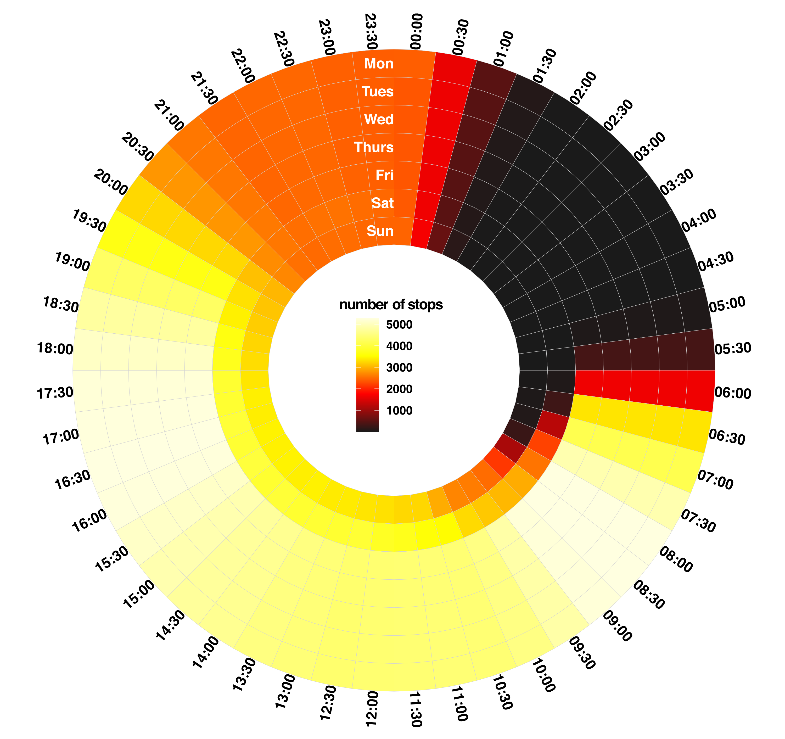

# Public Transport Accessibility Statistics


```{r, echo=FALSE, eval=TRUE, warning=FALSE, message=FALSE}
library(webshot)
library(sf)
library(dplyr)
library(glue)
library(gtfstools)
library(tidyverse)
library(lubridate)
library(colorspace)
library(terra)
library(opentripplanner) 
library(gtfs2gps)
library(elevatr)
library(terra)
library(stringi)
library(openrouteservice)
library(sf)
```


Before using OTP to estimate travel times, we can use the GTFS data to estimate what percentage of the population can access a public transport stop.


## Using a radius

The easiest way would be to create a 500m buffer around all public transport stops (or any other arbitrary radius) and check how many people live within that buffer. Under this method, **86.8%** of the people living in The Hague are within an accessible distance of a public transport stop.


```{r, eval=F}
# load stops
all_stops <- subset_gtfs_file$stops %>%
  st_as_sf(coords = c("stop_lon", "stop_lat")) %>%
  st_set_crs(st_crs("+proj=longlat"))

# draw a 500 meter buffer around the sops and combine the radiuses
# into a single polygon
subset_stops_buffer <- st_union(st_buffer(all_stops,dist = 500))
subset_stops_buffer <- st_cast(subset_stops_buffer, "MULTIPOLYGON") %>%
  st_as_sf()

# calculate the percentage of the population that lives within this
# polygon 
round(sum(raster::extract(population_data_city_brick,
                          subset_stops_buffer,fun=sum, na.rm =TRUE)) /
  sum(as.matrix(population_data_city_brick), na.rm = TRUE) *100, 2)

```

```{r, eval=F}
86.8
```


## Using actual walking distances


Instead of using straight line distance, we can use the OpenStreetMap  mapping data and OpenRouteService API (locally via Docker) to compute a 500m walking distance isochrone (technically an isodistance). An isodistance is the walking distance over the actual road network that can be reached from a given point. 


```{r,echo=FALSE, fig.cap = 'Example of an isodistance Map with polygons showing the 500, 1000, 1500, and 2000m distance that can be reacher from a bus stop in Delft (near The Hague) using the road network',out.width="100%"}
knitr::include_graphics("images/isochrome_example.png")
```


We can loop over all the public transport stops in a FUA to compute the 500m isodistance map over each stop and then again compute what percentage of the population lives in the combined shapefiles of these isodistance polygons. For this I use the  `ors_isochrones()`^[https://rdrr.io/github/GIScience/openrouteservice-r/man/ors_isochrones.html] function from the `openrouteservice` package.


```{r, eval=F}
# set up a datafram with just the lng/lat over every stop
all_stops_simple <- all_stops %>%
  dplyr::mutate(lon = sf::st_coordinates(.)[,1],
                lat = sf::st_coordinates(.)[,2])  %>%
  st_drop_geometry() %>% 
  select(stop_id , lon, lat)

# create empty tible for results
results <- tibble()

for(i in 1:nrow(all_stops_simple)){
  tryCatch({ # include a tryCatch to continue if there is an error
    res <- ors_isochrones(all_stops_simple %>%
                            slice(i) %>% 
                            select(-stop_id),
                          range = 500, 
                          profile  = "foot-walking",
                          range_type = "distance",
                          smoothing = 0,
                          area_units = "m",
                          units = "m",
                          id = "myid",
                          output = "sf") %>% 
      mutate(stop_id = all_stops_simple %>%
               slice(i) %>% 
               pull(stop_id))
    
    if(nrow(results) == 0){
      results <-   res
      
    }else{
      results <- rbind(results,  res)
    }
  }, error=function(e){cat("ERROR :",conditionMessage(e), "\n")})
}

# combine all the results
walking_dist_500_m <- st_union(results) %>% 
  st_as_sf()
```


Clearly, the shapefile that consists only of the isodistance maps would be smaller than the one that uses the radius around the public transport stops. In this interactive map I have summarised the public transport stops, the radius method, the isodistance method and the population density.


```{r, echo= FALSE, out.width="100%", out.height="500px", message=FALSE}
radius_500m <- readRDS("large_file_storage/buffer_500m_thehague.rds")
walking_dist_500_m <- readRDS("large_file_storage/walking_dist_500_m_thehague.rds")
Public_transport_stops <-  readRDS("large_file_storage/all_stops.rds")
population_density <-  readRDS("large_file_storage/population_data_city_brick.rds")

mapview::mapview(radius_500m, alpha.regions = 0.2,  col.regions="darkgreen")+
  mapview::mapview(walking_dist_500_m, alpha.regions = 0.2,  col.regions="darkred") +
  mapview::mapview(Public_transport_stops, col.regions="black",   cex = 0.5, alpha.regions = 0.5) +
  mapview::mapview(population_density,  alpha.regions = 0.5, hide = TRUE)
```


Using the isodistance road network method, only **66.9%** of the city lives within walkable distance to a public transport stop. 


```{r, eval = FALSE}
round(sum(raster::extract(population_data_city_brick,
                          walking_dist_500_m,fun=sum, na.rm = TRUE)) /
  sum(as.matrix(population_data_city_brick), na.rm = TRUE) *100, 1)
```


```{r, eval = FALSE}
66.9
```

## Adding some restrictions.

### Only stops that are served at least twice on workdays between 7 am and 9 am are taken into account

The advantage of using the GTFS data to compute the accessibility of public transport is that it allows for a very flexible method of selecting which public transport stops should be included in the computation. Not all stops are served every hour or even every day. It is apparent that most cities have a greatly reduced service during the night. For example, the plot below shows the number of stops in ‘use’ (at least one public transport provider stops there during this period) for the city of The Hague for a full week. It is clear that fewer stops are used during weekends than during weekdays and that fewer stops are used at night and during mid-day than during peak hours in the morning and afternoon.


```{r, eval = FALSE}
trips_for_stop <- subset_gtfs_file$stop_times %>%
  filter(stop_id %in% c(my_stop_id))

all_trips <- subset_gtfs_file$trips %>% 
  filter(trip_id %in% unique(trips_for_stop$trip_id ))


calendar_dates <- subset_gtfs_file$calendar_dates %>% 
  filter(service_id %in% unique(all_trips$service_id)) %>% 
  as_tibble() 


stop_times_stats_per_stop <- trips_for_stop %>%
  select(stop_id, trip_id ,  departure_time) %>%
  left_join(
    all_trips %>%
      select(service_id, trip_id) %>%
      distinct() %>%
      left_join(calendar_dates, by = "service_id"),
    by = "trip_id"
  ) %>%
  as_tibble() %>%
  mutate(date = ymd(date)) %>% 
  # there are some depart in a time after 24h, these need to be moved to the next day
  mutate(dep_after_midnight = substr(departure_time, 1, 2) %>%  as.numeric() - 23 > 0) %>%
  mutate(departure_time  = as.character(departure_time )) %>% 
  mutate(
    departure_time = if_else(dep_after_midnight,
                             paste0(
                               str_pad(
                                 as.numeric(substr(departure_time, 1, 2)) - 24,
                                 width = 2,
                                 side = "left",
                                 pad = "0"
                               ),
                               substr(departure_time, 3, 1000)
                             ),
                             departure_time),
    date =  if_else(dep_after_midnight, date + days(1), date)
  ) %>%
  mutate(departure_date = lubridate::ymd_hms(str_glue("{as.character(date)} {departure_time}"))) %>%
  mutate(departure_date_rounded = round_date(departure_date,
                                             unit = "30 minutes")) %>%
  mutate(week_day = weekdays(departure_date_rounded)) %>%
  filter(date >= lubridate::ymd(start_date),
         date <= lubridate::ymd(end_date)) %>% 
  mutate(departure_time_rounded = substr(as.character(departure_date_rounded), 12, 1000))

my_df <- stop_times_stats_per_stop %>% 
  group_by(week_day, departure_time_rounded) %>% 
  summarise(n = n(),
            n_dist = n_distinct(stop_id)) %>% 
  ungroup() %>% 
  mutate(weekday_num = case_when(week_day == "Monday" ~ 7,
                                 week_day == "Tuesday" ~ 6,
                                 week_day == "Wednesday" ~ 5,
                                 week_day == "Thursday" ~ 4,
                                 week_day == "Friday" ~ 3,
                                 week_day == "Saturday" ~ 2,
                                 week_day == "Sunday" ~ 1)) %>%
  mutate(departure_time_rounded = as.factor(substr(departure_time_rounded,1 ,5)))


n_white_gaps <- 0

label_data <- my_df %>%
  select(departure_time_rounded) %>%
  distinct() %>%
  mutate(angle = 90 - 360 * (as.numeric(departure_time_rounded)-0.5) / (n() + n_white_gaps)) %>%
  mutate(hjust = ifelse(angle < -90, 1, 0)) %>%
  mutate(angle = ifelse(angle < -90, angle+180, angle))


my_colour_scale <- colorRampPalette(c("grey10", "red", "yellow", "lightyellow"))


p3 <- my_df%>% 
  ggplot(aes(y = weekday_num,
             x = departure_time_rounded, 
             fill = n ))+
  geom_tile(col = 'lightgrey') +
  scale_fill_gradientn(colours = my_colour_scale(256))+
  labs(y = "time",
       x = "day of week") +
  theme_void() +
  scale_y_continuous(limits = c(-4, 8)) +
  coord_polar(start = 0, clip = "off") +
  geom_text(
    data = tibble(
      y = 1:7,
      x = 0.5,
      labels =  rev(c("Mon",
                      "Tues",
                      "Wed",
                      "Thurs" , 
                      "Fri", 
                      "Sat",
                      "Sun"))
    ),
    aes(x = x ,
        y = y,
        label = labels),
    hjust = 1,
    col = "white",
    fontface =  "bold",
    inherit.aes = F
  ) +
  geom_text(
    data = label_data,
    aes(
      x = departure_time_rounded,
      y = 7.5,
      label = departure_time_rounded,
      hjust = hjust
    ),
    color = "black",
    fontface =  "bold",
    angle = label_data$angle,
    inherit.aes = FALSE
  ) +
  labs(fill = "number of stops")
```

```{r,echo=FALSE, fig.cap = 'Circular heatmap showing the number of public transport stops in use for one week at diffeent moments of the day in The Hague, Netherlands.',out.width="100%"}

```


The fact that someone lives near to a stop does not mean that stop is particularly useful for me if it is only served once a day. For example, using the GTFS scheduling data, we can check what percentage of the population lives within 500-meter walking distance to a stop that is served at least twice on workdays between 7 am and 9 am (**66.5%**). 


```{r, eval = FALSE}
# Filter for stops that are serviced at least twice on workdays between 7 am and 9 am 
selected_stop_ids <- stop_times_stats_per_stop %>% 
  filter(!week_day %in% c("Saturday", "Sunday")) %>% 
  select(stop_id, departure_date) %>% 
  mutate(departure_date_standardized =ymd_hms(paste0("2022-01-01 ", substr(as.character(departure_date), 12, 20)))) %>% 
  filter(departure_date_standardized < ymd_hms(paste0("2022-01-01 09:00:00")),
         departure_date_standardized > ymd_hms(paste0("2022-01-01 07:00:00"))) %>% 
  count(stop_id) %>% 
  filter(n >= 5 *2) %>%  # filter only stops that occur at least twice (on average for the 5 days in this week)
  pull(stop_id)

# Use the same code to compute the combined isodistance 
# shapefiles for just the filtered stops
filtered_results_mornings <- results %>% 
  filter(stop_id %in%selected_stop_ids) 

filtered_walking_dist_500_m_morings <- st_union(filtered_results_mornings) %>% st_as_sf()

round(sum(raster::extract(population_data_city_brick,
                          filtered_walking_dist_500_m_morings,fun=sum, na.rm =TRUE)) /
  sum(as.matrix(population_data_city_brick), na.rm = TRUE) *100, 1)
```

```{r, eval = FALSE}
66.5
```


### Only look at stops that are wheelchair accessible

Another advantage of using GTFS data is the fact that GTFS stores information on the wheelchair accessibility of public transport stops. This means that is possible to filter out only those stops that are wheelchair accessible and compute what percentage of the population lives within a wheelchair-accessible public transport stop. In The Hague, this is only   **53.6%**. This indicator is closely linked to SUMI indicator 2: *"Accessibility of public transport for mobility-impaired groups indicator"*^[(Accessibility of public transport for mobility-impaired groups indicator)[https://transport.ec.europa.eu/other-pages/transport-basic-page/accessibility-public-transport-mobility-impaired-groups-indicator_en]]


```{r, eval = FALSE}
# filter for only stops that are wheelchair accessible
selected_stop_ids_wheelchair <- all_stops %>% 
  filter(wheelchair_boarding == 1) %>% 
  pull(stop_id )

filtered_results_wheel_chair <- results %>% 
  filter(stop_id %in%selected_stop_ids_wheelchair) 


filtered_walking_dist_500_m_wheelchair <- st_union(filtered_results_wheel_chair) %>% st_as_sf()

round(sum(raster::extract(population_data_city_brick,filtered_walking_dist_500_m_wheelchair,fun=sum, na.rm =TRUE)) /
  sum(as.matrix(population_data_city_brick), na.rm = TRUE) *100, 1)
```

```{r, eval = FALSE}
53.6
```


