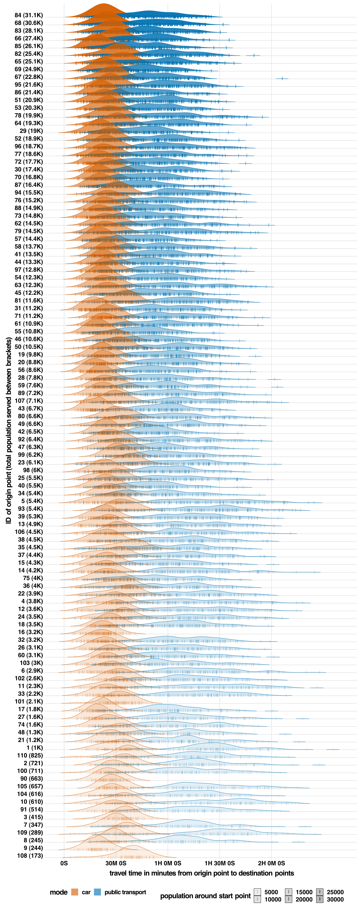

# Origin-Destination Methods

```{r, echo=FALSE, eval=TRUE, warning=FALSE, message=FALSE}
library(webshot)

library(sf)
library(dplyr)
library(glue)
library(gtfstools)
library(tidyverse)
library(lubridate)
library(colorspace)
library(terra)
library(opentripplanner) 
library(gtfs2gps)
library(elevatr)
library(terra)
library(stringi)
library(openrouteservice)
library(sf)
```


## Introduction

Another method that can be used to compute expected travel times is using the grid method, which computes the travel time between any two grid points. You can then compute the average expected travel time between any two points within an urban area. If you then compute this travel time for multiple transport modes, say both public transport and using a private car, you can compare the time ‘penalty’ paid using public transport as compared to taking a private car.


## Limitations

It is important to realize that there are some clear limitations to the computation of this statistic. 

1)	To compute the travel time using a private car, this method just uses the road network from OpenStreetMaps to compute the expected travel time. Traffic jams during rush hour are therefore not considered.
2)	To compute the travel time using a private car, it is assumed that the trip starts straight away from the starting point and ends perfectly at the endpoint. This means that time spent walking to the parked car at the start of the journey and time spent parking the car at the end of the journey are not included. In contrast, the time spent walking to a public transport stop is included.


Hopefully, some of these limitations will have a consistent effect across the different FUAs, in which case comparisons of the different FUAs is still valuable even if absolute values are not accurate. It is not within the scope of this proof of concept to quantify these biases. These limitations mean that the travel time by car is likely to be underestimated compared to travel time by public transport. Some of the limitations can likely be partially addressed by using the Google Maps API instead of these open-source methods. Google Maps has data on current and past traffic situations that can be used to estimate car travel time while considering likely traffic jams. Opensource methods do not have such user information.


## Creating grid and run OTP

Again, we can use OpenTripPlanner to compute the quickest travel time between any combination of points for different transport modes. This means that you can use the same grid as in previous examples, but the code used for this code takes longer to run per grid point, and therefore I used a wider-spaced grid in this example. In this example, there are 136 different points which means there are $136 * 135 = 18,360$ different routes to plan. 


```{r, eval=FALSE}
grid_2 <- expand.grid(seq(bounding_box[1], bounding_box[3], by = 0.02),
                    seq(bounding_box[2], bounding_box[4], by = 0.02)) %>%
  as_tibble() %>%
  mutate(id = 1:n()) %>%
  relocate(id) %>%
  setNames(c("id", "lon","lat")) %>%
  st_as_sf(coords = c("lon", "lat")) %>%
  st_set_crs(st_crs("+proj=longlat")) %>%
  mutate(point_in = as.numeric(st_intersects(., city_shape_file))) %>%
  filter(!is.na(point_in))%>%
  dplyr::mutate(lon = sf::st_coordinates(.)[,1],
                lat = sf::st_coordinates(.)[,2])

dest_matrix <- grid_2 %>%
  select(id, lon, lat) %>% 
  st_drop_geometry() %>% 
  as.matrix()

dest_matrixt_tib <- as_tibble(dest_matrix) %>% 
  mutate(str_loc  = paste0(substr(as.character(format(round(lat, 7), nsmall = 7)),1 ,10),
                           ",",
                           substr(as.character(format(round(lon, 7), nsmall = 7)),1 ,9))) %>% 
  rename(end_id = id)

```


After the creation of the grid, this code loops again over all the points and computes the expected travel time between all combinations of points and saves the travel time and the best route as calculated by the OTP algorithm. For this purpose, I use the `otp_plan()` function from the `opentripplanner` package.


```{r, eval=FALSE}
# create empty lists to store results
list_results_org_dest_car <- list()
list_results_org_dest_PS <- list()

# loop over points in grid
for (i in 1:nrow(grid_2)) {
  tryCatch({
    
# select current point    
    test_point <- grid_2 %>%
      slice(i)
    
    id <- test_point$id
    
    start_lon <- test_point$lon
    start_lat <- test_point$lat
    
# compute the the travel times for the car    
    complete_plan_car <- otp_plan(
      otpcon = otpcon,
      fromPlace = c(start_lon, start_lat),
      toPlace = dest_matrix[, 2:3],
      mode = c("CAR"),
      ncores = 4,
      maxWalkDistance = 2000,
      date_time = date_and_time
    )
    
# compute the the travel times for public transport
    
    complete_plan_public_transport <- otp_plan(
      otpcon = otpcon,
      fromPlace = c(start_lon, start_lat),
      toPlace = dest_matrix[, 2:3],
      mode = c("WALK", "TRANSIT"),
      ncores = 4,
      maxWalkDistance = 2000,
      date_time = date_and_time
    )
  
# per OD point compute the fastest route and if the route 
# consists of different legs, then combine these
      
    output_car <- left_join(complete_plan_car %>%
                              group_by(fromPlace, toPlace, route_option) %>% 
                              summarize(startTime = unique(startTime),
                                        endTime = unique(endTime),
                                        duration = unique(duration),
                                        geometry = st_union(geometry)) %>% 
                              ungroup() %>% 
                              filter(!st_is(. , "POINT")) %>% 
                              group_by(fromPlace, toPlace) %>% 
                              filter(duration == min(duration)) %>% 
                              slice(1)%>%
                              ungroup(),
                            dest_matrixt_tib, by = c("toPlace" = "str_loc")) %>% 
      mutate(start_id = id)%>%
      mutate(start_lon,
             start_lat)
    
    
    output_PS <- left_join(complete_plan_public_transport %>%
                             group_by(fromPlace, toPlace, route_option) %>% 
                             summarize(startTime = unique(startTime),
                                       endTime = unique(endTime),
                                       duration = unique(duration),
                                       geometry = st_union(geometry)) %>% 
                             ungroup() %>% 
                             filter(!st_is(. , "POINT")) %>% 
                             group_by(fromPlace, toPlace) %>% 
                             filter(duration == min(duration)) %>% 
                             slice(1) %>%
                             ungroup() ,
                            dest_matrixt_tib, by = c("toPlace" = "str_loc")) %>% 
      mutate(start_id = id)%>%
      mutate(start_lon,
             start_lat)
    
# store the results in a list    
    list_results_org_dest_car[[i]] <- output_car
    list_results_org_dest_PS[[i]] <- output_PS
  
    print(paste0(i, " of ", nrow(grid_2)))
  },
  error = function(e) {
    cat("ERROR :", conditionMessage(e), "\n")
  })
}

# combine the results in a single dataframe
org_dest_PS <- do.call("rbind", list_results_org_dest_PS)
org_dest_car <- do.call("rbind", list_results_org_dest_car)
```


After computing all the travel times for both car and public transport, these data can be used to compute the average travel time to any other point. Also, as before, we can use a voronoi method to compute the number of people served by each point of the grid. We can then compute a ratio of travel time for public transport and a private car for every origin-destination combination.

```{r, eval=FALSE}

# compute voronos
my_vor_2 <- st_as_sf(terra::voronoi(terra::vect(grid_2))) %>% 
  st_intersection(city_shape_file)

my_vor_2$pop <- as.numeric(extract(population_data_city_brick,my_vor_2,fun=sum, na.rm =TRUE))


# Format the data into a format that is more manageable 
org_dest_car_formatted <-  org_dest_car %>% 
  select(start_id, end_id, duration) %>% 
  left_join(my_vor_2 %>% st_drop_geometry() %>% select(id, pop),
            by = c("start_id" = "id"))

org_dest_PS_formatted <- org_dest_PS %>% 
  select(start_id, end_id, duration) %>% 
  left_join(my_vor_2 %>% st_drop_geometry() %>% select(id, pop),
            by = c("start_id" = "id"))

# combine the car and public transport data
org_dest_PS_car_formatted <- bind_rows("car" = org_dest_car_formatted,
                                       "public transport" = org_dest_PS_formatted,
                                       .id = "mode")

# compute ratio travel time public transport and car
org_dest_PS_car_formatted %>% 
  st_drop_geometry() %>% 
  pivot_wider(names_from = mode, values_from = duration) %>% 
  mutate(ratio = `public transport`/car) %>% 
  summarise(mean_ratio = mean(ratio, na.rm = TRUE),
            weighted_mean_ratio = weighted.mean(ratio, na.rm = TRUE, w = pop))  %>% 
  kableExtra::kable() %>% 
  kableExtra::kable_styling(bootstrap_options = c("striped", "hover"))


```

```{r, eval=TRUE, echo=FALSE}
tibble( mean_ratio =  2.50, weighted_mean_ratio =   2.32  ) %>% 
kableExtra::kable() %>% 
  kableExtra::kable_styling(bootstrap_options = c("striped", "hover"))
```

In The Hague, the average travel time by public transport between any two points in the city is 2.5 times longer than by private car. When weighting this average by the amount of people living nearest to a point (giving more weight to the number starting points in densely populated areas), this becomes 2.32 times longer. It is also possible to plot the differences in expected travel time for different starting points. The plot below shows for each starting point (order from most to least densely populated) the distribution of travel time to all the other points. There seems to be a negative relationship between the population density of an area is and the average travel time to all other points. In other words, more densely populated areas are better served by public transport than less densely populated ones. This correlation is not as strong for private cars.


```{r, eval=FALSE}
library(ggridges)


dens_plot <- org_dest_PS_car_formatted %>%
  mutate(label = as.numeric(as.factor(start_id))) %>%
  mutate(label = glue("{label} ({format_bignum(round(pop))})")) %>%
  ggplot(aes(
    x = duration,
    y =  fct_reorder(label, pop),
    alpha = pop,
    fill = mode,
    col = mode
  )) +
  geom_density_ridges(
    jittered_points = TRUE,
    scale = 2,
    rel_min_height = 0.01,
    point_shape = "|",
    point_size = 3,
    size = 0.25,
    position = position_points_jitter(height = 0)
  ) +
  scale_x_continuous(labels = seconds_to_period, 
                     breaks = seq(0, 8000, 1800)) +
  scale_fill_manual(
    values = c("#D55E0050", "#0072B250"),
    labels = c("car", "public transport")
  ) +
  scale_color_manual(values = c("#D55E00", "#0072B2"), guide = "none") +
  scale_discrete_manual("point_color",
                        values = c("#D55E00", "#0072B2"),
                        guide = "none") +
  coord_cartesian(clip = "off", expand = FALSE) +
  guides(fill = guide_legend(override.aes = list(
    fill = c("#D55E00A0", "#0072B2A0"),
    color = NA,
    point_color = NA,
    title = "transport mode"
  )),
  alpha =  guide_legend(title = "population around start point")) +
  scale_alpha_continuous(range = c(0.1, 0.95), breaks = seq(0, 31000, 5000)) +
  theme_ridges(center = TRUE) +
  theme(legend.position = "bottom") +
  labs(x = "travel time in minutes from origin point to destination points",
       y = "ID of origin point (total population served between brackets)")


dens_plot
```


```{r,echo=FALSE, fig.cap = 'Density plots of expected travel time for both car and public transport form different starting points to all other points',out.width="100%"}

```


